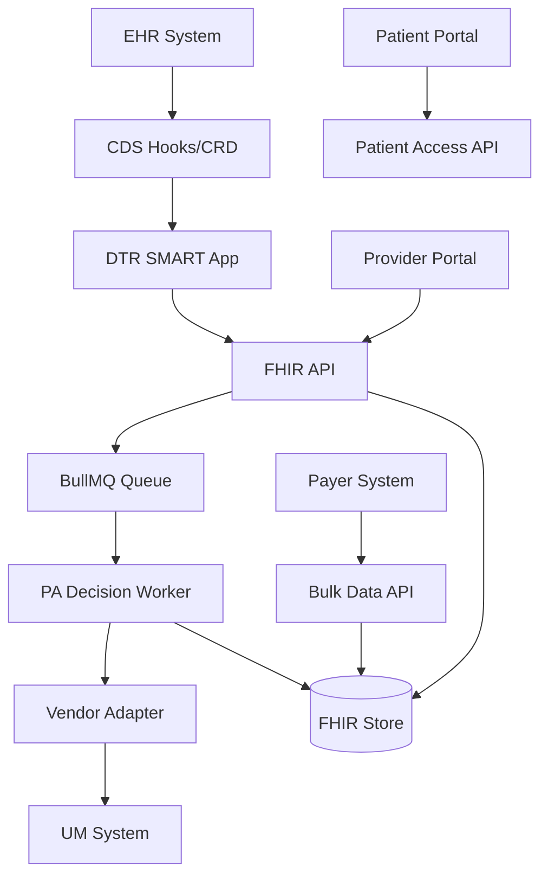

# FHIR IQ Prior Authorization System (FPAS)

[](https://www.cms.gov/regulations-and-guidance)
[](http://hl7.org/fhir/)
[](http://hl7.org/fhir/us/davinci-pas/)
[](http://hl7.org/fhir/us/davinci-dtr/)

A comprehensive FHIR-based Prior Authorization System demonstrating CMS API compliance for the January 1, 2027 deadline. This proof-of-concept implements the HL7 Da Vinci PAS and DTR Implementation Guides with production-ready architecture.

## 🎯 Key Features

- **CMS API Compliance** - Implements all four required API patterns for 2027 deadline
- **Pure FHIR Approach** - Native FHIR workflows without mandatory X12 transformation
- **CRD Hooks Integration** - Real-time prior authorization awareness during clinical workflows
- **DTR Support** - Documentation Templates and Rules with CQL-based prepopulation
- **Vendor Adapter Pattern** - Pluggable architecture for any utilization management vendor
- **SMART on FHIR v2** - Secure OAuth 2.0 authentication with fine-grained scopes

## 📋 Table of Contents

- [Quick Start](#-quick-start)
- [Architecture](#-architecture)
- [API Documentation](#-api-documentation)
- [CMS Compliance](#-cms-compliance)
- [Deployment](#-deployment)
- [Testing](#-testing)
- [Contributing](#-contributing)
- [License](#-license)

## 🚀 Quick Start

### Prerequisites

- Node.js 18+ and npm 9+
- Redis 7+ (for queue management)
- Docker (optional, for containerized deployment)

### Local Development

```bash
# Clone the repository
git clone https://github.com/your-org/FPAS.git
cd FPAS

# Install dependencies
cd fhir-iq-prior-auth/implementation
npm install

# Set up environment variables
cp .env.example .env
# Edit .env with your configuration

# Start Redis (using Docker)
docker run -d -p 6379:6379 redis:7-alpine

# Start the development server
npm run dev

# Server runs at http://localhost:3000
```

### Quick Test

```bash
# Run demo workflow
npm run demo:full-workflow

# Test CRD hooks
npm run demo:crd

# Test vendor adapters
npm run demo:vendor-adapters
```

## 🏗️ Architecture



### Core Components

- **FHIR Server** - Fastify-based REST API implementing Da Vinci PAS operations
- **CRD Service** - CDS Hooks for order-select and order-sign events
- **DTR Engine** - CQL-based prepopulation with SMART launch support
- **Queue Worker** - Asynchronous PA processing with BullMQ/Redis
- **Vendor Adapters** - Pluggable integration with external UM systems
- **Patient Access API** - CMS-compliant patient data access endpoints

## 📚 API Documentation

### Prior Authorization API

| Operation | Endpoint | Description |
|-----------|----------|-------------|
| Submit PA | `POST /fhir/Claim/$submit` | Submit prior authorization request |
| Query Status | `POST /fhir/Claim/$inquire` | Query PA request status |
| Cancel PA | `POST /fhir/Claim/$cancel` | Cancel pending PA request |

### CDS Hooks

| Hook | Endpoint | Trigger |
|------|----------|---------|
| Discovery | `GET /cds-services` | List available hooks |
| Order Select | `POST /cds-services/pa-order-select` | Provider selects order |
| Order Sign | `POST /cds-services/pa-order-sign` | Provider signs order |

### Patient Access API

| Resource | Endpoint | Scope Required |
|----------|----------|----------------|
| Everything | `GET /fhir/Patient/{id}/$everything` | `patient/*.read` |
| Coverage | `GET /fhir/Coverage` | `patient/Coverage.read` |
| Claims | `GET /fhir/Claim` | `patient/Claim.read` |
| Bulk Export | `GET /fhir/Patient/$export` | `system/*.read` |

### DTR Launch

| Function | Endpoint | Description |
|----------|----------|-------------|
| SMART Launch | `GET /dtr-launch` | Launch DTR questionnaire app |
| Submit Response | `POST /dtr-submit` | Submit completed questionnaire |

## 📊 CMS Compliance

### Implementation Guide Versions

All canonicals are pinned for compliance stability:

- **Da Vinci PAS**: v2.0.1
- **Da Vinci DTR**: v2.0.1
- **Da Vinci HRex**: v1.1.0
- **US Core**: v6.1.0
- **Da Vinci PDex**: v2.1.0 (planned)

### Compliance Status

| API Pattern | Status | Notes |
|-------------|--------|-------|
| Prior Authorization API | ✅ Complete | Full PAS operations with DTR |
| Patient Access API | 🚧 In Progress | Basic implementation ready |
| Provider Access API | 📋 Planned | Framework established |
| Payer-to-Payer Bulk | 📋 Planned | Bulk export initiated |

**Deadline**: January 1, 2027 (600+ days remaining)

## 🚢 Deployment

### Vercel Deployment

[](https://vercel.com/new/clone?repository-url=https%3A%2F%2Fgithub.com%2Fyour-org%2FFPAS)

1. Click the Deploy button above
2. Configure environment variables:
   ```
   NODE_ENV=production
   REDIS_URL=your-redis-url
   FHIR_BASE_URL=https://your-domain.vercel.app/fhir
   JWT_SECRET=your-jwt-secret
   ```
3. Deploy and test at `https://your-app.vercel.app`

### Docker Deployment

```bash
# Build Docker image
docker build -t fpas:latest .

# Run with Docker Compose
docker-compose up -d

# Access at http://localhost:3000
```

### Environment Variables

Create a `.env` file with:

```env
# Server Configuration
NODE_ENV=production
PORT=3000
BASE_URL=https://your-domain.com

# Redis Configuration
REDIS_URL=redis://localhost:6379

# FHIR Configuration
FHIR_BASE_URL=https://your-domain.com/fhir
FHIR_VERSION=4.0.1

# Security
JWT_SECRET=your-secure-secret
JWT_EXPIRY=1h
CORS_ORIGIN=https://your-ehr.com

# Vendor Adapters (optional)
ENABLE_X12_MAPPING=false
MOCK_VENDOR_ENABLED=true
```

## 🧪 Testing

### Automated Tests

```bash
# Run all tests
npm test

# CMS compliance validation
npm run test:cms-compliance

# PA API tests
npm run test:pa-api

# FHIR validation
npm run test:fhir-validation

# Inferno DTR validation
npm run test:inferno-dtr
```

### Demo Scripts

```bash
# Full workflow demonstration
npm run demo:full-workflow

# CRD hooks demo
npm run demo:crd

# DTR workflow demo
npm run demo:dtr

# Vendor adapter demo
npm run demo:vendor-adapters
```

### Performance Testing

```bash
# Load testing with Artillery
npm run test:performance

# Stress test PA submissions
npm run test:stress
```

## 📖 Documentation

- [CMS API Compliance Guide](./specs/conformance/cms-api-compliance.md)
- [CRD Integration Guide](./fhir-iq-prior-auth/implementation/docs/crd-integration-guide.md)
- [X12 278 Mapping Specification](./specs/mappings/pas-to-x12-278-map.md)
- [API Reference](./fhir-iq-prior-auth/implementation/docs/api-reference.md)

## 🤝 Contributing

We welcome contributions! Please see our [Contributing Guide](CONTRIBUTING.md) for details.

### Development Workflow

1. Fork the repository
2. Create a feature branch (`git checkout -b feature/amazing-feature`)
3. Commit your changes (`git commit -m 'Add amazing feature'`)
4. Push to the branch (`git push origin feature/amazing-feature`)
5. Open a Pull Request

### Code Quality

- Run linter: `npm run lint`
- Fix linting issues: `npm run lint:fix`
- Type checking: `npm run type-check`

## 📄 License

This project is licensed under the MIT License - see the [LICENSE](LICENSE) file for details.

## 🙏 Acknowledgments

- [HL7 International](http://hl7.org/) for FHIR specifications
- [Da Vinci Project](http://www.hl7.org/about/davinci/) for PAS and DTR Implementation Guides
- [CMS](https://www.cms.gov/) for interoperability requirements
- [Inferno Framework](https://inferno.healthit.gov/) for DTR testing tools

## 📞 Support

- **Issues**: [GitHub Issues](https://github.com/your-org/FPAS/issues)
- **Discussions**: [GitHub Discussions](https://github.com/your-org/FPAS/discussions)
- **Email**: support@fhir-iq.com

---

**Built with ❤️ for healthcare interoperability**

*This is a proof-of-concept implementation for demonstration purposes. Production deployment requires additional security hardening, performance optimization, and compliance validation.*