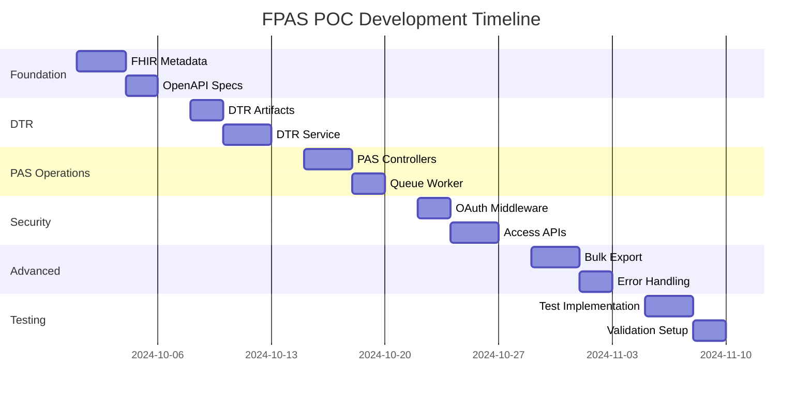

# Development Tasks Breakdown

## Task Organization Strategy

Each task generates specific deliverables aligned with the `/specs` and `/implementation` directory structure. Tasks are designed to be independently implementable while building toward the complete POC system.

## Phase 1: Foundation & FHIR Metadata (Week 1)

### Task 1.1: CapabilityStatements and OperationDefinitions
**Deliverables:** `/specs/fhir/capabilitystatements/` and `/specs/fhir/operations/`

#### Subtasks:
1. **Generate PAS CapabilityStatement**
   ```typescript
   // implementation/scripts/generate-capability.ts
   - Create CapabilityStatement for Payer PAS API
   - Include Claim/$submit and Claim/$inquire operations
   - Define supported search parameters and includes
   - Export to specs/fhir/capabilitystatements/payer-pas-capabilitystatement.json
   ```

2. **Generate Provider Access CapabilityStatement**
   ```typescript
   - Create CapabilityStatement for Provider Access API
   - Include Claim read operations with proper scopes
   - Define OAuth 2.0 security requirements
   - Export to specs/fhir/capabilitystatements/payer-provider-access-capabilitystatement.json
   ```

3. **Create Operation Definitions**
   ```typescript
   - Implement Claim/$submit OperationDefinition
   - Implement Claim/$inquire OperationDefinition
   - Include input/output parameters and examples
   - Export to specs/fhir/operations/claim-$submit.operation.json
   - Export to specs/fhir/operations/claim-$inquire.operation.json
   ```

#### Acceptance Criteria:
- [ ] CapabilityStatements validate against FHIR R4 schema
- [ ] Operations reference correct Da Vinci PAS profiles
- [ ] All JSON files pass fhir-validator CLI validation
- [ ] Files exactly match specs/ directory structure

### Task 1.2: OpenAPI Specification Generation
**Deliverables:** `/specs/openapi/` and API documentation

#### Subtasks:
1. **PAS Operations OpenAPI**
   ```typescript
   // implementation/api-gateway/src/schemas/openapi-pas.ts
   - Generate OpenAPI 3.0 spec for Claim/$submit
   - Generate OpenAPI 3.0 spec for Claim/$inquire
   - Include OAuth 2.0 security definitions
   - Map FHIR operations to REST endpoints
   ```

2. **Provider Access OpenAPI**
   ```typescript
   - Generate OpenAPI spec for Claim search operations
   - Include SMART on FHIR scope definitions
   - Document query parameters and response formats
   - Add error response schemas with OperationOutcome
   ```

3. **Bulk Export OpenAPI**
   ```typescript
   - Generate OpenAPI spec for Group/$export operation
   - Document async workflow with polling endpoints
   - Include signed URL response format
   - Add progress tracking endpoints
   ```

#### Acceptance Criteria:
- [ ] OpenAPI specs validate against OpenAPI 3.0 schema
- [ ] All FHIR operations properly documented
- [ ] OAuth flows correctly specified
- [ ] Swagger UI renders properly from generated specs

## Phase 2: DTR Implementation (Week 2)

### Task 2.1: DTR Questionnaire and CQL Implementation
**Deliverables:** `/specs/dtr/questionnaires/` and `/specs/dtr/libraries/`

#### Subtasks:
1. **Enhanced Questionnaire Creation**
   ```typescript
   // implementation/scripts/generate-dtr-artifacts.ts
   - Enhance existing imaging-lumbar-mri.json questionnaire
   - Add proper DTR profile references
   - Include all required questionnaire metadata
   - Add conditional logic and skip patterns
   ```

2. **CQL Library Implementation**
   ```typescript
   - Complete imaging-lumbar-mri.cql with production-ready logic
   - Add proper value set definitions
   - Implement error handling in CQL expressions
   - Add comprehensive function documentation
   ```

3. **CQL Library FHIR Resource**
   ```typescript
   - Convert .cql file to FHIR Library resource
   - Include base64-encoded CQL content
   - Add proper metadata and dependencies
   - Export to specs/dtr/libraries/imaging-lumbar-mri-library.json
   ```

#### Acceptance Criteria:
- [ ] Questionnaire validates against DTR IG profiles
- [ ] CQL library compiles without errors
- [ ] Library resource contains valid base64 CQL content
- [ ] All DTR artifacts reference correct canonical URLs

### Task 2.2: DTR Service Implementation
**Deliverables:** `/implementation/api-gateway/src/services/dtr-service.ts`

#### Subtasks:
1. **Questionnaire Serving**
   ```typescript
   // implementation/api-gateway/src/controllers/dtr-controller.ts
   - Implement GET /Questionnaire endpoint
   - Add service-type based questionnaire selection
   - Include CQL library references in response
   - Add proper content negotiation
   ```

2. **CQL Execution Engine (Mock)**
   ```typescript
   // implementation/api-gateway/src/services/cql-engine.ts
   - Implement mock CQL execution service
   - Simulate data extraction from patient records
   - Return structured CQL results
   - Add error handling for missing data
   ```

3. **Prepopulation Service**
   ```typescript
   // implementation/api-gateway/src/services/prepopulation-service.ts
   - Implement QuestionnaireResponse/$populate operation
   - Execute CQL expressions against patient data
   - Generate prepopulated QuestionnaireResponse
   - Handle partial prepopulation scenarios
   ```

#### Acceptance Criteria:
- [ ] DTR endpoints return valid FHIR resources
- [ ] CQL execution produces expected results
- [ ] Prepopulation handles all questionnaire items
- [ ] Error responses include proper OperationOutcome

## Phase 3: PAS Operations Implementation (Week 3)

### Task 3.1: Claim/$submit and Claim/$inquire Controllers
**Deliverables:** `/implementation/api-gateway/src/controllers/pas-controller.ts`

#### Subtasks:
1. **PAS Bundle Validation**
   ```typescript
   // implementation/api-gateway/src/services/validation-service.ts
   - Implement PAS Bundle profile validation
   - Validate all contained resources against profiles
   - Check business rules (provider attribution, coverage)
   - Generate detailed OperationOutcome for errors
   ```

2. **Claim/$submit Implementation**
   ```typescript
   // implementation/api-gateway/src/controllers/pas-controller.ts
   - Parse and validate incoming PAS Bundle
   - Extract Claim and supporting resources
   - Implement synchronous and asynchronous response patterns
   - Queue requests for UM processing
   ```

3. **Claim/$inquire Implementation**
   ```typescript
   - Implement authorization status inquiry
   - Support multiple search parameters
   - Return ClaimResponse with current status
   - Include Task resources for async workflows
   ```

4. **Response Bundle Generation**
   ```typescript
   // implementation/api-gateway/src/services/response-builder.ts
   - Build PAS response Bundles
   - Include ClaimResponse with authorization details
   - Add CommunicationRequest for pended cases
   - Generate proper Bundle structure and references
   ```

#### Acceptance Criteria:
- [ ] All PAS operations validate input against profiles
- [ ] Synchronous responses return within 2 seconds
- [ ] Asynchronous workflows create proper Task resources
- [ ] Response bundles validate against PAS profiles

### Task 3.2: Queue Worker with UM Rules Engine
**Deliverables:** `/implementation/api-gateway/src/queues/pa-worker.ts`

#### Subtasks:
1. **BullMQ Queue Setup**
   ```typescript
   // implementation/api-gateway/src/queues/queue-manager.ts
   - Configure Redis connection with proper retry logic
   - Set up PA request queue with appropriate settings
   - Implement job priority and delay handling
   - Add queue monitoring and health checks
   ```

2. **Mock UM Engine**
   ```typescript
   // implementation/api-gateway/src/services/um-engine.ts
   - Implement simple approval rules based on DTR responses
   - Simulate conservative therapy requirements
   - Add neurologic deficit decision logic
   - Include random pend/deny scenarios for testing
   ```

3. **PA Worker Implementation**
   ```typescript
   // implementation/api-gateway/src/queues/pa-worker.ts
   - Process PA requests from queue
   - Apply UM rules to determine authorization
   - Generate ClaimResponse based on decision
   - Update Task status and notify requestors
   ```

4. **Job Progress Tracking**
   ```typescript
   - Implement progress updates for long-running jobs
   - Add job failure handling and retry logic
   - Generate audit events for all decisions
   - Update Task resources with current status
   ```

#### Acceptance Criteria:
- [ ] Queue processes jobs reliably with retry logic
- [ ] UM engine makes decisions based on clinical data
- [ ] Job progress tracking works correctly
- [ ] Failed jobs generate appropriate error responses

## Phase 4: Access APIs and Security (Week 4)

### Task 4.1: OAuth Middleware and Scope Checking
**Deliverables:** `/implementation/api-gateway/src/middleware/oauth-middleware.ts`

#### Subtasks:
1. **JWT Token Validation**
   ```typescript
   // implementation/api-gateway/src/middleware/auth-middleware.ts
   - Implement JWT signature validation
   - Validate token expiration and not-before claims
   - Extract organization and user claims
   - Cache valid tokens for performance
   ```

2. **SMART Scope Enforcement**
   ```typescript
   // implementation/api-gateway/src/middleware/scope-middleware.ts
   - Implement scope checking for user/* and patient/* scopes
   - Validate system/* scopes for bulk operations
   - Enforce resource-level access controls
   - Generate proper 403 responses for insufficient scopes
   ```

3. **Provider Attribution Validation**
   ```typescript
   // implementation/api-gateway/src/services/attribution-service.ts
   - Implement static allowlist for POC
   - Validate provider NPI against patient attribution
   - Check organization membership for requests
   - Add audit logging for all access attempts
   ```

4. **Rate Limiting Implementation**
   ```typescript
   // implementation/api-gateway/src/middleware/rate-limit-middleware.ts
   - Implement per-organization rate limiting
   - Add different limits for different operation types
   - Use Redis for distributed rate limit tracking
   - Return proper 429 responses with retry-after headers
   ```

#### Acceptance Criteria:
- [ ] JWT validation rejects invalid or expired tokens
- [ ] Scope enforcement prevents unauthorized access
- [ ] Provider attribution blocks non-attributed requests
- [ ] Rate limiting prevents abuse while allowing normal usage

### Task 4.2: Provider and Patient Access APIs
**Deliverables:** `/implementation/api-gateway/src/controllers/access-controller.ts`

#### Subtasks:
1. **Provider Access Implementation**
   ```typescript
   // implementation/api-gateway/src/controllers/provider-access-controller.ts
   - Implement Claim search with patient filtering
   - Add date range and status filtering
   - Support _include for related resources
   - Enforce organization-based access controls
   ```

2. **Patient Access Implementation**
   ```typescript
   // implementation/api-gateway/src/controllers/patient-access-controller.ts
   - Implement patient-scoped Claim access
   - Filter results to patient's own data only
   - Support search by authorization status
   - Include ClaimResponse data in responses
   ```

3. **Search Parameter Handling**
   ```typescript
   // implementation/api-gateway/src/services/search-service.ts
   - Implement FHIR search parameter parsing
   - Add support for date, token, and reference searches
   - Implement _count and _offset for pagination
   - Add _sort support for common parameters
   ```

4. **Bundle Response Generation**
   ```typescript
   // implementation/api-gateway/src/services/bundle-service.ts
   - Generate searchset Bundles for search results
   - Include proper total count and navigation links
   - Add _include processing for related resources
   - Implement proper Bundle.link for pagination
   ```

#### Acceptance Criteria:
- [ ] Provider access returns only attributed patient data
- [ ] Patient access enforces patient scope restrictions
- [ ] Search parameters work correctly with proper filtering
- [ ] Bundle responses include proper pagination links

## Phase 5: Bulk Export and Advanced Features (Week 5)

### Task 5.1: Payer-to-Payer Bulk Export
**Deliverables:** `/implementation/api-gateway/src/controllers/bulk-export-controller.ts`

#### Subtasks:
1. **Group-based Export Operation**
   ```typescript
   // implementation/api-gateway/src/controllers/bulk-export-controller.ts
   - Implement Group/$export operation
   - Support _type parameter for resource filtering
   - Implement _since parameter for incremental export
   - Add proper async workflow with status polling
   ```

2. **Export Job Processing**
   ```typescript
   // implementation/api-gateway/src/services/export-service.ts
   - Generate NDJSON files for each resource type
   - Implement 5-year data window filtering
   - Add member consent validation
   - Generate signed URLs for file access
   ```

3. **File Storage and Delivery**
   ```typescript
   // implementation/api-gateway/src/services/storage-service.ts
   - Implement file storage abstraction (local/S3)
   - Generate time-limited signed URLs
   - Add file cleanup after expiration
   - Include progress tracking for large exports
   ```

4. **Status Polling Implementation**
   ```typescript
   - Implement export status endpoint
   - Return progress information and estimated completion
   - Include file manifest when export completes
   - Add proper error handling for failed exports
   ```

#### Acceptance Criteria:
- [ ] Export operations handle large member groups (1000+ members)
- [ ] NDJSON files validate as proper FHIR resources
- [ ] Signed URLs provide secure, time-limited access
- [ ] Status polling provides accurate progress information

### Task 5.2: Error Handling and OperationOutcome Generation
**Deliverables:** `/implementation/api-gateway/src/services/error-service.ts`

#### Subtasks:
1. **Standardized Error Responses**
   ```typescript
   // implementation/api-gateway/src/services/error-service.ts
   - Implement OperationOutcome generation for all error types
   - Add proper HTTP status code mapping
   - Include diagnostic information and location details
   - Generate consistent error response format
   ```

2. **Validation Error Handling**
   ```typescript
   - Convert FHIR validation errors to OperationOutcome
   - Include FHIRPath expressions for field-level errors
   - Add business rule violation handling
   - Generate user-friendly error messages
   ```

3. **Retry-After Header Implementation**
   ```typescript
   - Add retry-after headers for 503 responses
   - Implement exponential backoff recommendations
   - Include service unavailable error handling
   - Add proper timeout handling for long operations
   ```

4. **Audit and Monitoring Integration**
   ```typescript
   // implementation/api-gateway/src/services/audit-service.ts
   - Log all errors with proper classification
   - Add metrics collection for error rates
   - Implement alerting for critical errors
   - Generate compliance audit trails
   ```

#### Acceptance Criteria:
- [ ] All errors return proper OperationOutcome resources
- [ ] HTTP status codes align with FHIR specification
- [ ] Retry-after headers provide appropriate guidance
- [ ] Error logs include sufficient diagnostic information

## Phase 6: Testing and Validation (Week 6)

### Task 6.1: Test Fixtures and Unit Tests
**Deliverables:** `/implementation/test-fixtures/` and comprehensive test suite

#### Subtasks:
1. **Test Fixture Creation**
   ```typescript
   // implementation/test-fixtures/sample-requests/
   - Create valid PAS request bundles for different scenarios
   - Generate DTR questionnaire responses with various answers
   - Add patient and coverage test data
   - Include error scenario test cases
   ```

2. **Unit Test Implementation**
   ```typescript
   // implementation/api-gateway/tests/unit/
   - Test PAS operation controllers with mocked dependencies
   - Test DTR service with known CQL inputs
   - Test OAuth middleware with various token scenarios
   - Test UM engine with different clinical scenarios
   ```

3. **Integration Test Suite**
   ```typescript
   // implementation/api-gateway/tests/integration/
   - Test end-to-end PA workflows
   - Test DTR questionnaire retrieval and prepopulation
   - Test provider access with proper authorization
   - Test bulk export with realistic data volumes
   ```

4. **Performance Test Setup**
   ```typescript
   // implementation/api-gateway/tests/performance/
   - Create load tests for PA submission endpoints
   - Test concurrent access patterns
   - Validate queue processing under load
   - Test bulk export performance with large datasets
   ```

#### Acceptance Criteria:
- [ ] Unit test coverage exceeds 80% for business logic
- [ ] Integration tests cover all major workflows
- [ ] Performance tests validate SLA requirements
- [ ] Test fixtures cover both success and error scenarios

### Task 6.2: FHIR Validation and Inferno Integration
**Deliverables:** `/implementation/scripts/` and CI/CD integration

#### Subtasks:
1. **FHIR Validator Integration**
   ```bash
   # implementation/scripts/validate-fhir.sh
   - Create script to validate all FHIR resources
   - Integrate Da Vinci PAS and DTR IG packages
   - Add validation to CI/CD pipeline
   - Generate validation reports for all artifacts
   ```

2. **Inferno DTR Test Integration**
   ```typescript
   // implementation/scripts/run-inferno-tests.sh
   - Set up Inferno DTR test suite
   - Configure test endpoints for POC
   - Create automated test execution
   - Generate compliance reports
   ```

3. **Continuous Validation Pipeline**
   ```yaml
   # .github/workflows/validation.yml
   - Run FHIR validation on all resource changes
   - Execute Inferno tests on relevant PRs
   - Generate validation artifacts
   - Block deployment on validation failures
   ```

4. **Validation Reporting**
   ```typescript
   // implementation/scripts/generate-validation-report.ts
   - Aggregate validation results from multiple sources
   - Generate compliance dashboard
   - Include pass/fail metrics for all tests
   - Export reports in multiple formats
   ```

#### Acceptance Criteria:
- [ ] All FHIR resources pass IG profile validation
- [ ] Inferno DTR tests execute successfully
- [ ] CI/CD pipeline blocks invalid changes
- [ ] Validation reports provide actionable feedback

## Development Timeline



## Task Dependencies

1. **FHIR Metadata** → **OpenAPI Specs** → **PAS Controllers**
2. **DTR Artifacts** → **DTR Service** → **PAS Controllers**
3. **OAuth Middleware** → **Access APIs** → **Bulk Export**
4. **All Implementation Tasks** → **Test Implementation** → **Validation Setup**

## Success Metrics

### Task Completion Criteria
- [ ] All tasks produce deliverables in correct directory structure
- [ ] FHIR resources validate against IG profiles
- [ ] Unit tests achieve 80%+ coverage
- [ ] Integration tests cover all major workflows
- [ ] Performance targets met for all operations

### Quality Gates
- [ ] No FHIR validation errors in CI/CD
- [ ] All Inferno DTR tests pass
- [ ] Load tests meet performance SLAs
- [ ] Security scans pass with no critical issues
- [ ] Documentation coverage complete for all APIs

This task breakdown provides a clear roadmap for implementing the FPAS POC with specific deliverables, acceptance criteria, and quality gates for each development phase.