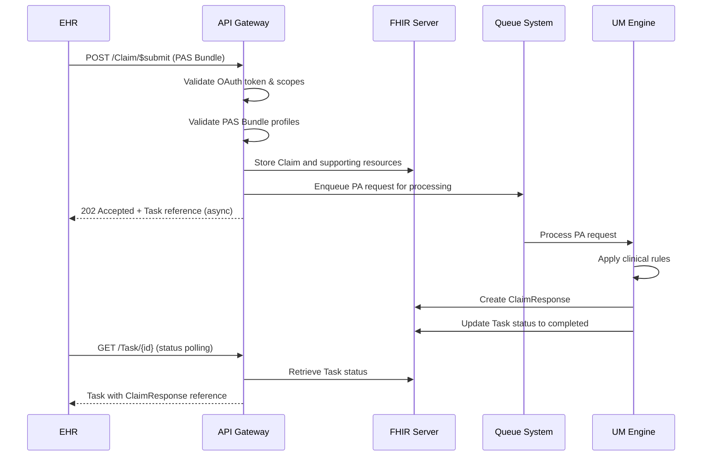
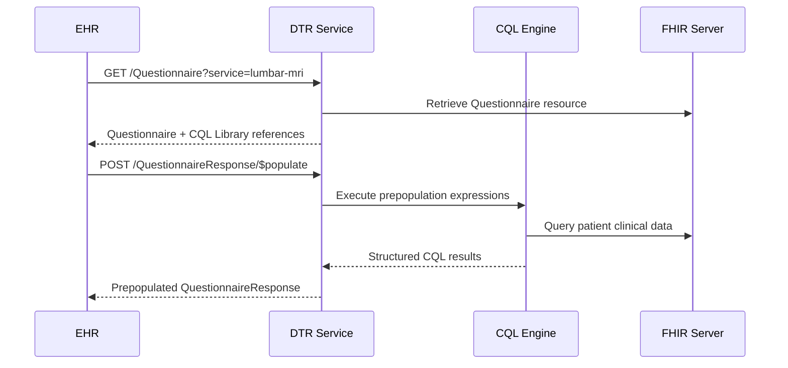

# RFC-0001: FHIR Prior Authorization POC System

- **Status**: Draft
- **Author(s)**: FHIR IQ Development Team
- **Created**: 2024-09-28
- **Updated**: 2024-09-28

## Summary

This RFC specifies the design and implementation of a Proof of Concept (POC) FHIR-based Prior Authorization system demonstrating compliance with CMS-0057-F interoperability requirements using HL7 Da Vinci Implementation Guides.

## Motivation

Healthcare prior authorization processes are currently fragmented, causing provider burden and patient care delays. The CMS-0057-F Final Rule mandates that payers implement standardized FHIR APIs for prior authorization by January 1, 2026. This POC demonstrates a compliant implementation path using established HL7 standards.

### Goals

- Demonstrate **FHIR PAS** (Prior Authorization Support) operations for real-time authorization requests
- Integrate **FHIR DTR** (Documentation Templates and Rules) for automated clinical data collection
- Implement **Provider/Patient Access APIs** for authorization transparency
- Support **Payer-to-Payer bulk export** for member data portability
- Provide **end-to-end workflow** from clinical documentation through authorization decision

### Non-Goals

- **Production UM Integration**: POC uses mock utilization management rules
- **Full CRD Implementation**: Basic Clinical Decision Support hooks only
- **Multi-tenant Architecture**: Single payer configuration for demonstration
- **Enterprise Security**: Simplified OAuth with static configurations

## Detailed Design

### Architecture Overview

```
┌─────────────────┐    ┌──────────────────┐    ┌─────────────────┐
│   EHR System    │───▶│   API Gateway    │───▶│  HAPI FHIR      │
│                 │    │ (Node.js/Fastify)│    │   Server        │
│ - DTR Client    │    │                  │    │                 │
│ - PAS Client    │    │ - OAuth Validate │    │ - R4 Resources  │
│ - SMART App     │    │ - PAS Operations │    │ - Profile Valid │
└─────────────────┘    │ - Queue Manager  │    │ - Terminology   │
                       └──────────────────┘    └─────────────────┘
                               │                         │
                               ▼                         ▼
                       ┌──────────────────┐    ┌─────────────────┐
                       │   Background     │    │   PostgreSQL    │
                       │   Processing     │    │   Database      │
                       │                  │    │                 │
                       │ - UM Engine      │    │ - FHIR Data     │
                       │ - BullMQ Worker  │    │ - Audit Logs    │
                       │ - Redis Queue    │    │ - User Sessions │
                       └──────────────────┘    └─────────────────┘
```

### Core Components

#### 1. FHIR Operations Layer

**Claim/$submit Operation**
- **Input**: PAS Bundle containing Claim, Patient, Coverage, QuestionnaireResponse
- **Processing**: Validate profiles, check provider attribution, queue for UM review
- **Output**: ClaimResponse with authorization decision or async Task reference

**Claim/$inquire Operation**
- **Input**: Search parameters for existing authorization
- **Processing**: Lookup authorization by claim reference or authorization number
- **Output**: Current ClaimResponse with status and decision details

#### 2. DTR Integration Layer

**Questionnaire Service**
- Serve FHIR Questionnaires with embedded CQL expressions
- Support service-type based questionnaire selection
- Include CQL Library references for data extraction

**CQL Execution Engine**
- Execute Clinical Quality Language expressions against patient data
- Return structured results for questionnaire prepopulation
- Handle data availability and error conditions

#### 3. Security and Authorization

**OAuth 2.0 with SMART on FHIR v2**
- Support authorization code flow for provider applications
- Implement client credentials flow for system-to-system integration
- Enforce granular scopes: `user/Claim.read`, `system/Claim.write`, `patient/Claim.read`

**Access Control Matrix**
```
| Actor        | Scope              | Resources         | Operations    |
|--------------|-------------------|-------------------|---------------|
| Provider     | user/Claim.read   | Claim,ClaimResp   | GET, Search   |
| EHR System   | system/Claim.write| Claim, Bundle     | POST, PUT     |
| Patient App  | patient/Claim.read| Claim,ClaimResp   | GET, Search   |
```

#### 4. Background Processing

**Queue-based UM Processing**
- BullMQ for reliable job processing with Redis backend
- Configurable job retry policies and failure handling
- Progress tracking via FHIR Task resources

**Mock UM Engine Rules**
```typescript
interface UMDecision {
  disposition: 'approved' | 'denied' | 'pended';
  authorizationNumber?: string;
  validityPeriod?: Period;
  requiresAdditionalInfo?: boolean;
  denyReason?: CodeableConcept;
}

class MockUMEngine {
  async evaluatePA(claim: Claim, questionnaireResponse: QuestionnaireResponse): Promise<UMDecision> {
    // Simple rule-based evaluation for POC
    const hasConservativeTherapy = this.checkConservativeTherapy(questionnaireResponse);
    const hasNeuroDeficit = this.checkNeuroDeficit(questionnaireResponse);

    if (hasConservativeTherapy && hasNeuroDeficit) {
      return { disposition: 'approved', authorizationNumber: generateAuthNumber() };
    } else if (hasConservativeTherapy) {
      return { disposition: 'pended', requiresAdditionalInfo: true };
    } else {
      return { disposition: 'denied', denyReason: noConservativeTherapyCode };
    }
  }
}
```

### Data Flow Specifications

#### 1. Prior Authorization Submission Flow



#### 2. DTR Questionnaire Flow



### Error Handling Specifications

**Standard Error Response Format**
```json
{
  "resourceType": "OperationOutcome",
  "issue": [{
    "severity": "error",
    "code": "invalid|forbidden|processing|information-required",
    "details": {
      "coding": [{
        "system": "http://fhir-iq.com/CodeSystem/pas-error-codes",
        "code": "specific-error-code",
        "display": "Human readable description"
      }]
    },
    "diagnostics": "Technical details for troubleshooting",
    "location": ["Resource.field.path"],
    "expression": ["FHIRPath expression"]
  }]
}
```

**HTTP Status Code Mapping**
- `400 Bad Request`: Profile validation failures, missing required elements
- `401 Unauthorized`: Invalid or missing authentication token
- `403 Forbidden`: Insufficient scopes, provider not attributed to patient
- `503 Service Unavailable`: UM engine temporarily unavailable (with retry-after)

### Performance Requirements

**Response Time SLAs**
- Synchronous operations: < 2 seconds (95th percentile)
- Search operations: < 1 second (95th percentile)
- Questionnaire retrieval: < 2 seconds (95th percentile)
- CQL execution: < 1 second (95th percentile)

**Concurrency Targets**
- Support 10 concurrent PA submissions without degradation
- Handle 50 concurrent status queries
- Process 5 background UM jobs per second

**Scalability Considerations**
- Stateless API gateway design for horizontal scaling
- Queue-based processing decouples load from response times
- Redis clustering support for high-availability queues

## Implementation Plan

### Phase 1: Foundation (Week 1)
- [ ] FHIR server deployment with Da Vinci IG packages
- [ ] API gateway scaffolding with Fastify and TypeScript
- [ ] OAuth mock provider configuration
- [ ] Basic health checks and monitoring

### Phase 2: Core PAS Operations (Week 2)
- [ ] Implement Claim/$submit operation with profile validation
- [ ] Implement Claim/$inquire operation with search support
- [ ] Queue system setup with BullMQ and Redis
- [ ] Mock UM engine with basic clinical rules

### Phase 3: DTR Integration (Week 3)
- [ ] Questionnaire serving endpoint
- [ ] CQL execution engine with mock patient data
- [ ] QuestionnaireResponse/$populate operation
- [ ] End-to-end DTR workflow testing

### Phase 4: Access APIs (Week 4)
- [ ] Provider Access API with OAuth scope enforcement
- [ ] Patient Access API with patient-scoped data
- [ ] Search parameter support and pagination
- [ ] Rate limiting and audit logging

### Phase 5: Advanced Features (Week 5)
- [ ] Payer-to-payer bulk export operation
- [ ] Comprehensive error handling with OperationOutcome
- [ ] Performance optimization and caching
- [ ] Security hardening and validation

### Phase 6: Testing and Validation (Week 6)
- [ ] Unit test suite with >80% coverage
- [ ] Integration tests for all workflows
- [ ] FHIR validator integration in CI/CD
- [ ] Inferno DTR test suite execution

## Security Considerations

### Authentication and Authorization
- All API endpoints require valid OAuth 2.0 Bearer tokens
- Tokens must include organization claims for provider attribution validation
- Patient access requires explicit patient consent scope
- System access uses client credentials with certificate-based authentication

### Data Protection
- All PHI encrypted in transit using TLS 1.3
- Database encryption at rest for all FHIR resources
- Audit logging for all data access with retention policies
- Rate limiting to prevent abuse and enumeration attacks

### Compliance Requirements
- HIPAA compliance for all PHI handling
- OAuth 2.0 security best practices implementation
- FHIR security guidelines adherence
- Regular security scanning and vulnerability assessment

## Testing Strategy

### Validation Framework
```yaml
# CI/CD Pipeline Validation Steps
validation:
  fhir-profiles:
    - Run HL7 FHIR validator against all resources
    - Validate against Da Vinci PAS/DTR profiles
    - Check terminology binding compliance

  inferno-testing:
    - Execute Inferno DTR test suite
    - Validate questionnaire retrieval and CQL execution
    - Test SMART app launch workflows

  integration-testing:
    - End-to-end PA submission scenarios
    - Multi-actor workflow validation
    - Error condition testing

  performance-testing:
    - Load testing with Artillery
    - Concurrent user simulation
    - SLA compliance verification
```

### Test Data Management
- Synthetic patient data conforming to US Core profiles
- Realistic clinical scenarios for PA decision testing
- Coverage and provider test data with proper attribution
- Edge case scenarios for error condition validation

## Migration and Rollout

### Deployment Strategy
1. **Local Development**: Docker Compose for complete stack
2. **CI/CD Integration**: GitHub Actions with automated validation
3. **Staging Environment**: Kubernetes deployment with monitoring
4. **Production Readiness**: Security scanning and compliance validation

### Success Metrics
- **Functional**: All acceptance criteria met with automated validation
- **Performance**: SLA targets achieved under load testing
- **Compliance**: Pass all Inferno DTR tests and FHIR validation
- **Documentation**: Complete API documentation and deployment guides

## Open Questions

1. **CQL Execution**: Should POC include actual CQL engine or simplified mock implementation?
2. **UM Integration**: What level of clinical rule complexity is needed for meaningful demonstration?
3. **Terminology Services**: Should POC include external terminology server integration?
4. **Bulk Export Scale**: What member group sizes should bulk export handle for realistic testing?

## References

- [CMS-0057-F Final Rule](https://www.cms.gov/newsroom/fact-sheets/cms-interoperability-and-patient-access-final-rule-cms-9115-f)
- [HL7 FHIR R4 Specification](http://hl7.org/fhir/R4/)
- [Da Vinci Prior Authorization Support IG](http://hl7.org/fhir/us/davinci-pas/)
- [Da Vinci Documentation Templates and Rules IG](http://hl7.org/fhir/us/davinci-dtr/)
- [SMART App Launch Framework v2](http://hl7.org/fhir/smart-app-launch/)
- [GitHub Spec Kit](https://github.com/github/spec-kit)