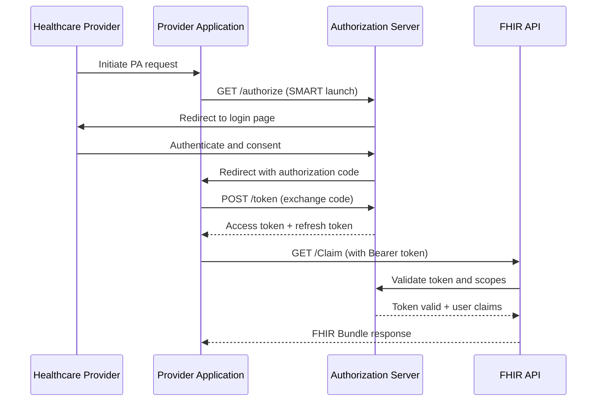
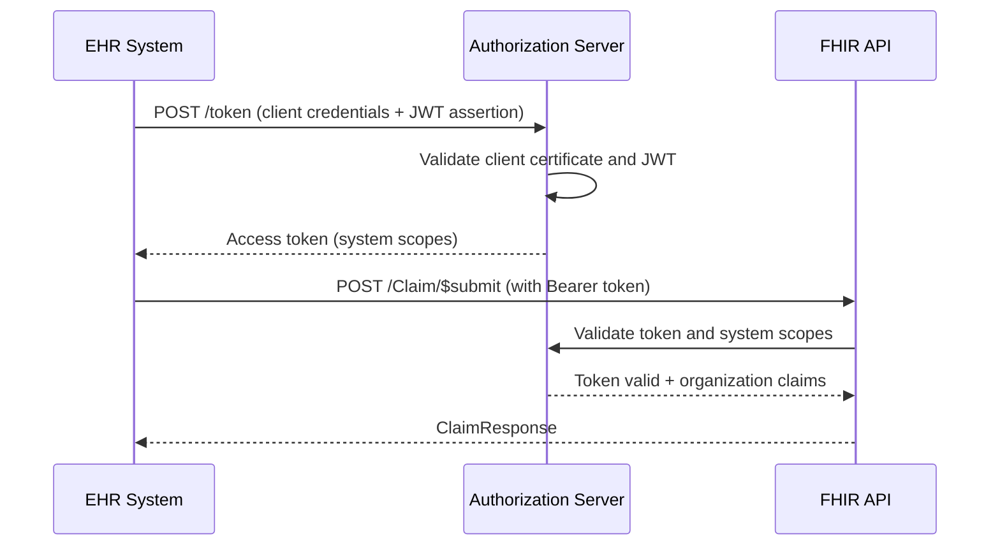

# RFC-0003: OAuth 2.0 and SMART on FHIR v2 Security Model

- **Status**: Draft
- **Author(s)**: FHIR IQ Development Team
- **Created**: 2024-09-28
- **Updated**: 2024-09-28
- **Supersedes**: N/A
- **Superseded by**: N/A

## Summary

This RFC specifies the security model for the FHIR Prior Authorization POC, implementing OAuth 2.0 with SMART on FHIR v2 for authentication and authorization, including scope-based access control and audit requirements.

## Motivation

Healthcare APIs require robust security to protect PHI while enabling interoperability. The SMART on FHIR v2 specification provides a standardized approach to OAuth 2.0 implementation for healthcare applications, ensuring proper authentication, authorization, and audit capabilities.

### Goals

- Implement **OAuth 2.0 with SMART on FHIR v2** for standardized authentication
- Support **multiple authorization flows** for different client types
- Enforce **granular scope-based access control** for FHIR resources
- Provide **comprehensive audit logging** for compliance requirements
- Enable **provider attribution validation** for patient data access
- Implement **rate limiting and abuse prevention** mechanisms

### Non-Goals

- **Production PKI Infrastructure**: POC uses mock certificate validation
- **Multi-factor Authentication**: Basic username/password for demonstration
- **Advanced Threat Detection**: Basic rate limiting only
- **Enterprise SSO Integration**: Standalone OAuth provider for POC

## Detailed Design

### Security Architecture

```
┌─────────────────┐    ┌──────────────────┐    ┌─────────────────┐
│   Client App    │───▶│  Authorization   │───▶│   Resource      │
│                 │    │     Server       │    │    Server       │
│ - EHR System    │    │                  │    │                 │
│ - Provider App  │    │ - OAuth 2.0      │    │ - FHIR API      │
│ - Patient App   │    │ - JWT Tokens     │    │ - Scope Check   │
│ - System Client │    │ - SMART Scopes   │    │ - Audit Log     │
└─────────────────┘    │ - Client Auth    │    │ - Rate Limit    │
                       └──────────────────┘    └─────────────────┘
                               │                         │
                               ▼                         ▼
                       ┌──────────────────┐    ┌─────────────────┐
                       │   Token Store    │    │  Audit Database │
                       │                  │    │                 │
                       │ - Active Tokens  │    │ - Access Logs   │
                       │ - Refresh Tokens │    │ - Error Events  │
                       │ - Client Creds   │    │ - Admin Actions │
                       └──────────────────┘    └─────────────────┘
```

### OAuth 2.0 Flows

#### 1. Authorization Code Flow (Provider Applications)

**Use Case**: Provider-facing applications accessing patient data with user context



**Authorization Request**
```http
GET /authorize?
  response_type=code&
  client_id=provider-app-12345&
  redirect_uri=https://provider-app.example.com/callback&
  scope=user/Claim.read user/ClaimResponse.read user/Patient.read&
  state=xyz123&
  aud=https://fhir-iq.com/fhir
```

**Token Exchange**
```http
POST /token
Content-Type: application/x-www-form-urlencoded

grant_type=authorization_code&
code=auth_code_12345&
redirect_uri=https://provider-app.example.com/callback&
client_id=provider-app-12345&
client_secret=secret_abc123
```

#### 2. Client Credentials Flow (System Integration)

**Use Case**: EHR systems and backend services for automated PA submission



**Client Credentials Request**
```http
POST /token
Content-Type: application/x-www-form-urlencoded

grant_type=client_credentials&
scope=system/Claim.write system/ClaimResponse.read&
client_assertion_type=urn:ietf:params:oauth:client-assertion-type:jwt-bearer&
client_assertion=eyJhbGciOiJSUzI1NiIs...
```

### SMART on FHIR v2 Scopes

#### User-Context Scopes

**Provider Access Scopes**
```yaml
POC Scopes (Simplified):
  user/*.read: "Read access to all resources for authenticated user"
  patient/*.read: "Read access to all patient resources"

Production Scopes (Granular):
  user/Claim.read: "Read prior authorization claims"
  user/ClaimResponse.read: "Read authorization responses"
  user/Coverage.read: "Read insurance coverage information"
  user/Patient.read: "Read patient demographics"
  user/Questionnaire.read: "Read DTR questionnaires"
  user/QuestionnaireResponse.read: "Read questionnaire responses"
  user/Task.read: "Read workflow tasks"
```

**Scope Implementation**
```typescript
interface ScopeDefinition {
  scope: string;
  resourceTypes: string[];
  interactions: ('read' | 'write' | 'create' | 'update' | 'delete')[];
  constraints?: {
    patientContext?: boolean;
    organizationContext?: boolean;
    timeWindow?: string;
  };
}

const scopeDefinitions: ScopeDefinition[] = [
  {
    scope: 'user/Claim.read',
    resourceTypes: ['Claim'],
    interactions: ['read'],
    constraints: {
      organizationContext: true,
      patientContext: false
    }
  },
  {
    scope: 'patient/Claim.read',
    resourceTypes: ['Claim'],
    interactions: ['read'],
    constraints: {
      patientContext: true,
      organizationContext: false
    }
  }
];
```

#### System Scopes

**System-to-System Access**
```yaml
System Scopes:
  system/Claim.write: "Submit prior authorization requests"
  system/ClaimResponse.read: "Read authorization decisions"
  system/Patient.read: "Read patient data for PA processing"
  system/Coverage.read: "Verify insurance coverage"
  system/Group.read: "Access member groups for bulk export"
  system/*.read: "Read access to all resources (bulk export)"
```

### Token Structure and Claims

#### Access Token Claims

**Required Claims**
```json
{
  "iss": "https://auth.fhir-iq.com",
  "sub": "provider-user-12345",
  "aud": "https://fhir-iq.com/fhir",
  "exp": 1695737400,
  "iat": 1695733800,
  "scope": "user/Claim.read user/ClaimResponse.read",
  "organization": {
    "resourceType": "Organization",
    "identifier": [
      {
        "system": "http://hl7.org/fhir/sid/us-npi",
        "value": "1234567890"
      }
    ],
    "name": "Springfield Medical Center"
  },
  "purpose_of_use": {
    "system": "http://terminology.hl7.org/CodeSystem/v3-ActReason",
    "code": "TREAT",
    "display": "Treatment"
  },
  "patient": "Patient/patient-12345"
}
```

**Client Assertion for System Access**
```json
{
  "iss": "ehr-system-client-id",
  "sub": "ehr-system-client-id",
  "aud": "https://auth.fhir-iq.com/token",
  "exp": 1695737400,
  "iat": 1695733800,
  "jti": "unique-jwt-id-12345",
  "organization": "1234567890",
  "purpose_of_use": "PAYMGT"
}
```

### Access Control Implementation

#### Middleware Architecture

```typescript
interface AuthContext {
  user?: {
    id: string;
    organization: string;
    purposeOfUse: string;
  };
  patient?: string;
  scopes: string[];
  tokenType: 'user' | 'patient' | 'system';
}

class AuthMiddleware {
  async validateToken(request: FastifyRequest): Promise<AuthContext> {
    const authHeader = request.headers.authorization;
    if (!authHeader?.startsWith('Bearer ')) {
      throw new UnauthorizedError('Bearer token required');
    }

    const token = authHeader.substring(7);
    const decoded = await this.jwtService.verify(token);

    // Validate token claims
    await this.validateTokenClaims(decoded);

    // Check organization allowlist (POC)
    await this.validateOrganization(decoded.organization);

    return {
      user: decoded.sub ? {
        id: decoded.sub,
        organization: decoded.organization?.identifier?.[0]?.value,
        purposeOfUse: decoded.purpose_of_use?.code
      } : undefined,
      patient: decoded.patient,
      scopes: decoded.scope?.split(' ') || [],
      tokenType: this.determineTokenType(decoded)
    };
  }

  async checkScope(requiredScope: string, context: AuthContext): Promise<boolean> {
    // Check if token has required scope
    if (!this.hasScope(context.scopes, requiredScope)) {
      return false;
    }

    // Additional context-based validation
    if (requiredScope.startsWith('patient/') && !context.patient) {
      return false;
    }

    if (requiredScope.startsWith('user/') && !context.user) {
      return false;
    }

    return true;
  }
}
```

#### Resource-Level Access Control

```typescript
interface AccessRule {
  resourceType: string;
  operation: string;
  check: (context: AuthContext, resourceId?: string) => Promise<boolean>;
}

const accessRules: AccessRule[] = [
  {
    resourceType: 'Claim',
    operation: 'read',
    check: async (context, resourceId) => {
      if (context.tokenType === 'patient') {
        // Patient can only access their own claims
        const claim = await fhirService.read('Claim', resourceId);
        return claim.patient.reference === `Patient/${context.patient}`;
      }

      if (context.tokenType === 'user') {
        // Provider can only access claims for their attributed patients
        return await this.checkProviderAttribution(context.user.organization, resourceId);
      }

      return context.tokenType === 'system';
    }
  }
];

class ResourceAccessController {
  async checkAccess(
    resourceType: string,
    operation: string,
    context: AuthContext,
    resourceId?: string
  ): Promise<boolean> {
    const rule = accessRules.find(r =>
      r.resourceType === resourceType && r.operation === operation
    );

    if (!rule) {
      return false; // Default deny
    }

    return await rule.check(context, resourceId);
  }
}
```

### Provider Attribution Validation

#### Static Allowlist (POC)

```typescript
interface OrganizationConfig {
  npi: string;
  name: string;
  allowedScopes: string[];
  attributedPatients?: string[];
  rateLimit?: {
    requestsPerMinute: number;
    burstLimit: number;
  };
}

const organizationAllowlist: OrganizationConfig[] = [
  {
    npi: "1234567890",
    name: "Springfield Medical Center",
    allowedScopes: ["user/Claim.read", "user/Claim.write", "system/Claim.write"],
    attributedPatients: ["patient-001", "patient-002", "patient-003"],
    rateLimit: {
      requestsPerMinute: 100,
      burstLimit: 150
    }
  },
  {
    npi: "9876543210",
    name: "Anytown Clinic",
    allowedScopes: ["user/Claim.read"],
    attributedPatients: ["patient-004", "patient-005"],
    rateLimit: {
      requestsPerMinute: 50,
      burstLimit: 75
    }
  }
];

class AttributionService {
  async validateProviderAttribution(
    organizationNPI: string,
    patientId: string
  ): Promise<boolean> {
    const org = organizationAllowlist.find(o => o.npi === organizationNPI);

    if (!org) {
      throw new ForbiddenError('Organization not authorized');
    }

    // For POC, use static attribution list
    return org.attributedPatients?.includes(patientId) || false;
  }

  async validateOrganizationScopes(
    organizationNPI: string,
    requestedScopes: string[]
  ): Promise<boolean> {
    const org = organizationAllowlist.find(o => o.npi === organizationNPI);

    if (!org) {
      return false;
    }

    return requestedScopes.every(scope => org.allowedScopes.includes(scope));
  }
}
```

### Rate Limiting and Abuse Prevention

#### Rate Limiting Implementation

```typescript
interface RateLimit {
  windowMs: number;
  maxRequests: number;
  keyGenerator: (request: FastifyRequest) => string;
  skipSuccessfulRequests?: boolean;
  skipFailedRequests?: boolean;
}

const rateLimitConfigs: Record<string, RateLimit> = {
  'provider-access': {
    windowMs: 60 * 1000, // 1 minute
    maxRequests: 100,
    keyGenerator: (req) => req.authContext?.user?.organization || req.ip
  },
  'system-access': {
    windowMs: 60 * 1000,
    maxRequests: 1000,
    keyGenerator: (req) => req.authContext?.user?.organization || req.ip
  },
  'patient-access': {
    windowMs: 60 * 1000,
    maxRequests: 50,
    keyGenerator: (req) => req.authContext?.patient || req.ip
  }
};

class RateLimitService {
  async checkRateLimit(
    request: FastifyRequest,
    limitType: string
  ): Promise<RateLimitResult> {
    const config = rateLimitConfigs[limitType];
    const key = config.keyGenerator(request);

    const current = await this.redis.incr(`rate_limit:${limitType}:${key}`);

    if (current === 1) {
      await this.redis.expire(`rate_limit:${limitType}:${key}`, config.windowMs / 1000);
    }

    const isLimited = current > config.maxRequests;
    const remaining = Math.max(0, config.maxRequests - current);
    const resetTime = await this.redis.ttl(`rate_limit:${limitType}:${key}`);

    return {
      limited: isLimited,
      remaining,
      resetTime,
      retryAfter: isLimited ? resetTime : 0
    };
  }
}
```

### Audit and Compliance

#### Audit Event Structure

```typescript
interface AuditEvent {
  timestamp: string;
  eventType: 'PA_SUBMISSION' | 'DATA_ACCESS' | 'AUTH_FAILURE' | 'RATE_LIMIT_EXCEEDED';
  actor: {
    type: 'user' | 'system' | 'patient';
    identifier: string;
    organization?: string;
    name?: string;
  };
  resource?: {
    type: string;
    id: string;
    patient?: string;
  };
  outcome: 'SUCCESS' | 'FAILURE' | 'WARNING';
  purposeOfUse?: string;
  userAgent?: string;
  sourceIP?: string;
  details?: Record<string, any>;
}

class AuditService {
  async logEvent(event: AuditEvent): Promise<void> {
    // Log to structured audit database
    await this.auditRepository.create(event);

    // For critical events, also log to security monitoring
    if (event.eventType === 'AUTH_FAILURE' || event.outcome === 'FAILURE') {
      await this.securityLogger.warn('Security event detected', event);
    }
  }

  async logDataAccess(
    context: AuthContext,
    resourceType: string,
    resourceId: string,
    operation: string,
    outcome: 'SUCCESS' | 'FAILURE'
  ): Promise<void> {
    await this.logEvent({
      timestamp: new Date().toISOString(),
      eventType: 'DATA_ACCESS',
      actor: {
        type: context.tokenType,
        identifier: context.user?.id || context.patient || 'system',
        organization: context.user?.organization
      },
      resource: {
        type: resourceType,
        id: resourceId
      },
      outcome,
      purposeOfUse: context.user?.purposeOfUse
    });
  }
}
```

### Error Responses

#### Security Error Responses

```typescript
class SecurityErrorHandler {
  buildUnauthorizedResponse(): OperationOutcome {
    return {
      resourceType: 'OperationOutcome',
      issue: [{
        severity: 'error',
        code: 'login',
        details: {
          coding: [{
            system: 'http://fhir-iq.com/CodeSystem/pas-error-codes',
            code: 'authentication-required',
            display: 'Valid authentication required'
          }]
        },
        diagnostics: 'Access token missing, invalid, or expired'
      }]
    };
  }

  buildForbiddenResponse(reason: string): OperationOutcome {
    return {
      resourceType: 'OperationOutcome',
      issue: [{
        severity: 'error',
        code: 'forbidden',
        details: {
          coding: [{
            system: 'http://fhir-iq.com/CodeSystem/pas-error-codes',
            code: 'insufficient-authorization',
            display: 'Insufficient authorization for requested operation'
          }]
        },
        diagnostics: reason
      }]
    };
  }

  buildRateLimitResponse(retryAfter: number): OperationOutcome {
    return {
      resourceType: 'OperationOutcome',
      issue: [{
        severity: 'error',
        code: 'throttled',
        details: {
          coding: [{
            system: 'http://fhir-iq.com/CodeSystem/pas-error-codes',
            code: 'rate-limit-exceeded',
            display: 'API rate limit exceeded'
          }]
        },
        diagnostics: `Rate limit exceeded. Retry after ${retryAfter} seconds.`
      }]
    };
  }
}
```

## Implementation Requirements

### Security Configuration

**OAuth Provider Configuration**
```yaml
OAuth Settings:
  issuer: "https://auth.fhir-iq.com"
  authorization_endpoint: "/authorize"
  token_endpoint: "/token"
  jwks_uri: "/.well-known/jwks.json"
  response_types_supported: ["code"]
  grant_types_supported: ["authorization_code", "client_credentials"]
  scopes_supported: ["user/Claim.read", "system/Claim.write", "patient/Claim.read"]
  token_endpoint_auth_methods_supported: ["client_secret_basic", "private_key_jwt"]

SMART Configuration:
  capabilities: ["launch-ehr", "permission-user", "permission-patient"]
  code_challenge_methods_supported: ["S256"]
  introspection_endpoint: "/introspect"
```

**JWT Configuration**
```yaml
JWT Settings:
  algorithm: "RS256"
  issuer: "https://auth.fhir-iq.com"
  audience: "https://fhir-iq.com/fhir"
  access_token_lifetime: 3600  # 1 hour
  refresh_token_lifetime: 2592000  # 30 days
  key_rotation_interval: 604800  # 7 days
```

### Testing Requirements

**Security Testing**
```yaml
Test Scenarios:
  Authentication:
    - Valid token acceptance
    - Invalid token rejection
    - Expired token handling
    - Missing token handling

  Authorization:
    - Scope enforcement validation
    - Resource-level access control
    - Provider attribution checks
    - Cross-organization access prevention

  Rate Limiting:
    - Rate limit enforcement
    - Burst handling
    - Rate limit headers
    - Organization-specific limits

  Audit:
    - Event logging accuracy
    - Audit trail completeness
    - Privacy compliance
    - Retention policy enforcement
```

## Security Best Practices

### Token Security
- Use short-lived access tokens (1 hour maximum)
- Implement proper token revocation
- Secure token storage and transmission
- Regular key rotation for JWT signing

### Transport Security
- TLS 1.3 for all communications
- Certificate pinning for critical connections
- HSTS headers for web interfaces
- Secure cookie settings

### Data Protection
- Encryption at rest for all PHI
- Field-level encryption for sensitive data
- Secure key management
- Regular security assessments

## Migration Path

### POC to Production
1. **PKI Integration**: Replace mock certificates with production PKI
2. **Multi-factor Authentication**: Add MFA for high-privilege access
3. **Advanced Monitoring**: Implement threat detection and response
4. **Identity Provider Integration**: Connect to enterprise identity systems

### Success Criteria
- [ ] OAuth 2.0 flows work correctly for all client types
- [ ] SMART scopes enforce proper access control
- [ ] Provider attribution prevents unauthorized access
- [ ] Rate limiting prevents abuse
- [ ] Audit logging captures all required events
- [ ] Security testing passes with no critical findings

## References

- [SMART App Launch Framework v2](http://hl7.org/fhir/smart-app-launch/)
- [OAuth 2.0 Security Best Practices](https://tools.ietf.org/html/draft-ietf-oauth-security-topics)
- [FHIR Security Guidelines](http://hl7.org/fhir/R4/security.html)
- [JWT Best Practices](https://tools.ietf.org/html/rfc8725)
- [NIST Cybersecurity Framework](https://www.nist.gov/cyberframework)