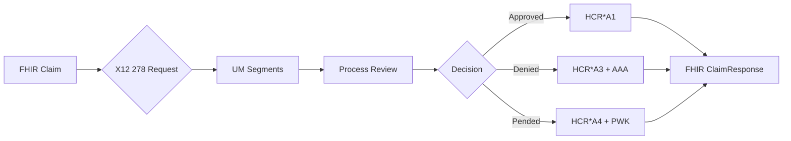

# FHIR PAS ↔ X12 278 Mapping Specification

## Overview

This document outlines the bidirectional mapping between FHIR R4 Prior Authorization Support (PAS) resources and X12 EDI 278 Health Care Services Review transactions. The mapping enables interoperability with legacy payer systems while maintaining FHIR-first architecture.

⚠️ **Important**: This specification references field mappings and segment structures. Detailed X12 implementation requires licensed X12 documentation from ASC X12. Internal implementation teams should consult licensed X12 guides for complete segment definitions and business rules.

## Architecture Separation

### Modular Design Principles

```typescript
// Pure FHIR deployment (CMS enforcement scenario)
import { PASProcessor } from './core/pas-processor';
// X12 mapper module excluded

// Legacy X12 integration deployment
import { PASProcessor } from './core/pas-processor';
import { X12Mapper } from './mappers/x12-278-mapper'; // Optional module
```

### Deployment Configurations

| Configuration | FHIR PAS Core | X12 Mapper | Use Case |
|---------------|---------------|------------|----------|
| **FHIR-Only** | ✅ Required | ❌ Excluded | CMS mandate compliance, modern payers |
| **Hybrid** | ✅ Required | ✅ Optional | Legacy system bridge, transition period |
| **Gateway** | ✅ Required | ✅ Required | Multi-payer hub, clearinghouse operations |

## X12 278 Transaction Structure

### Transaction Set Overview

```
ST*278*[Transaction Control Number]  // Transaction Set Header
BHT*[Transaction Set Purpose]*[Reference Number]*[Date]*[Time]  // Beginning of Hierarchical Transaction
HL*1**20*1~  // Submitter Level
NM1*41*[Submitter Info]  // Submitter Name
HL*2*1*21*1~  // Receiver Level
NM1*40*[Receiver Info]  // Receiver Name
HL*3*2*22*1~  // Provider Level
NM1*1P*[Provider Info]  // Provider Name
HL*4*3*23*0~  // Patient Level
NM1*QC*[Patient Info]  // Patient Name
[Service Level Segments]
SE*[Segment Count]*[Transaction Control Number]  // Transaction Set Trailer
```

## Core Resource Mappings

### 1. Bundle → Transaction Set Container

| FHIR PAS Element | X12 278 Segment | Notes |
|------------------|-----------------|-------|
| `Bundle.identifier` | `BHT03` (Reference Identification) | Transaction reference |
| `Bundle.timestamp` | `BHT04` (Date) + `BHT05` (Time) | Submission timestamp |
| `Bundle.type` = "collection" | `BHT01` = "0007" | Prior Authorization Request |
| `Bundle.entry[].resource` | Multiple HL hierarchies | Hierarchical structure mapping |

**Implementation Note**: Bundle structure maps to X12 hierarchical levels (HL segments) with specific relationship codes.

### 2. Claim → Service Request Information

| FHIR PAS Element | X12 278 Segment | Mapping Logic |
|------------------|-----------------|---------------|
| `Claim.identifier` | `REF*EW*[value]` | Prior auth reference number |
| `Claim.type.coding[0].code` | `BHT01` determination | Professional="0007", Institutional="0007" |
| `Claim.use` = "preauthorization" | `BHT01` = "0007" | Request type indicator |
| `Claim.status` | Derived from transaction flow | Active=Request, others=inquiry |
| `Claim.created` | `DTP*102*D8*[CCYYMMDD]` | Service date or creation |
| `Claim.patient.reference` | Patient HL + NM1*QC | Patient hierarchy level |
| `Claim.provider.reference` | Provider HL + NM1*1P | Requesting provider |
| `Claim.priority` | `UM*[Service Type Code]` | Priority/urgency indicator |

### 3. Claim.item[] → Service Line Details

| FHIR PAS Element | X12 278 Segment | Business Rule |
|------------------|-----------------|---------------|
| `item.sequence` | Loop iteration | Maintains service line order |
| `item.productOrService.coding` | `UM01` (Service Type Code) | CPT/HCPCS code mapping |
| `item.modifier[]` | `UM09` (Service Type Modifier) | Procedure modifiers |
| `item.quantity` | `QTY*CA*[value]` | Service quantity |
| `item.locationCodeableConcept` | `NM1*FA` (Facility) | Place of service |
| `item.bodySite` | `SV101` subset | Anatomical location |
| `item.unitPrice` | `SV102` (Line Item Charge) | Financial information |

### 4. Patient → Member Information

| FHIR PAS Element | X12 278 Segment | Validation Rules |
|------------------|-----------------|------------------|
| `Patient.identifier[0].value` | `NM109` (Member ID) | Primary member identifier |
| `Patient.identifier[0].system` | `NM108` (ID Code Qualifier) | "MI"=Member ID, "II"=SSN |
| `Patient.name[0].family` | `NM103` (Last Name) | Primary name only |
| `Patient.name[0].given[0]` | `NM104` (First Name) | First name only |
| `Patient.name[0].given[1]` | `NM105` (Middle Name) | Middle initial/name |
| `Patient.birthDate` | `DMG*D8*[CCYYMMDD]` | Date format conversion |
| `Patient.gender` | `DMG03` | "M"/"F"/"U" mapping |
| `Patient.address[0]` | `N3` + `N4` segments | Address components |

### 5. Practitioner/Organization → Provider Info

| FHIR PAS Element | X12 278 Segment | Qualifier Codes |
|------------------|-----------------|-----------------|
| `Practitioner.identifier[?].value` where `type.coding[0].code` = "NPI" | `NM109` + `NM108*XX` | NPI identifier |
| `Practitioner.name[0]` | `NM103`-`NM105` | Name components |
| `Organization.identifier[?].value` where `type.coding[0].code` = "NPI" | `NM109` + `NM108*XX` | Organization NPI |
| `Organization.name` | `NM103` | Organization name |
| `Organization.address[0]` | `N3` + `N4` | Organizational address |

### 6. ClaimResponse → 278 Response Transaction

| FHIR PAS Element | X12 278 Response Segment | Status Mapping |
|------------------|--------------------------|----------------|
| `ClaimResponse.outcome` | `HCR01` (Action Code) | "A1"=Approved, "A2"=Modified, "A3"=Denied, "A4"=Pended |
| `ClaimResponse.disposition` | `MSG` (Message Text) | Free-text explanation |
| `ClaimResponse.preAuthRef` | `REF*G1*[value]` | Authorization number |
| `ClaimResponse.item[].adjudication` | `HCR02`-`HCR05` | Decision details per service |
| `ClaimResponse.error[].code` | `AAA` segments | Error/rejection codes |

## Complex Mapping Scenarios

### DTR QuestionnaireResponse → PWK/NTE Segments

| FHIR Element | X12 Segment | Transformation Logic |
|--------------|-------------|---------------------|
| `QuestionnaireResponse.item[].linkId` | `PWK01` (Attachment Report Type) | Question identifier |
| `QuestionnaireResponse.item[].answer[].valueString` | `NTE02` (Description) | Text response |
| `QuestionnaireResponse.item[].answer[].valueBoolean` | `NTE02` mapped to "Y"/"N" | Boolean conversion |
| `QuestionnaireResponse.item[].answer[].valueInteger` | `NTE02` as numeric string | Number formatting |
| `QuestionnaireResponse.questionnaire` | `PWK02` (Report Transmission Code) | Template reference |

### Service Location Mapping

```typescript
// FHIR Place of Service → X12 Service Type Code mapping
const PLACE_OF_SERVICE_MAP = {
  "11": "Office",           // NM1*FA + N403*11
  "21": "Inpatient Hospital", // NM1*FA + N403*21
  "22": "Outpatient Hospital", // NM1*FA + N403*22
  "23": "Emergency Room",   // NM1*FA + N403*23
  // Additional mappings per CMS place of service codes
};
```

## Business Rule Mappings

### Prior Authorization Status Workflow



### Service Type Code Mapping

| FHIR Service Category | X12 UM01 Code | Description |
|-----------------------|---------------|-------------|
| Diagnostic Imaging | "3" | Consultation |
| Surgical Procedure | "1" | Specialty Care |
| Durable Medical Equipment | "6" | Equipment |
| Pharmacy | "B" | Prescription Drug |
| **Note**: Consult licensed X12 documentation for complete code sets |

## Technical Implementation Architecture

### Mapper Module Structure

```
src/mappers/x12-278/
├── index.ts                    // Module entry point
├── fhir-to-x12.mapper.ts      // FHIR → X12 transformation
├── x12-to-fhir.mapper.ts      // X12 → FHIR transformation
├── validation/
│   ├── x12-validator.ts       // X12 format validation
│   └── business-rules.ts      // X12 business rule validation
├── templates/
│   ├── 278-request.template.ts // X12 278 request template
│   └── 278-response.template.ts // X12 278 response template
└── utils/
    ├── segment-builder.ts     // X12 segment construction
    ├── date-formatter.ts      // Date format conversion
    └── code-mapper.ts         // Code system mapping
```

### Integration Points

```typescript
// Optional X12 integration
export interface PASProcessorConfig {
  enableX12Mapping?: boolean;
  x12Mapper?: X12MapperInterface;
  legacyEndpoints?: boolean;
}

// Pure FHIR processor (default)
const processor = new PASProcessor({
  enableX12Mapping: false  // No X12 dependencies
});

// Hybrid processor with X12 support
const processor = new PASProcessor({
  enableX12Mapping: true,
  x12Mapper: new X12278Mapper(),
  legacyEndpoints: true
});
```

## Data Quality and Validation

### FHIR → X12 Validation Rules

1. **Required Field Validation**
   - FHIR `Patient.identifier` must exist for X12 `NM109` (Member ID)
   - FHIR `Claim.item[].productOrService` required for `UM01` (Service Type)
   - Provider NPI required for `NM1*1P*XX*[NPI]`

2. **Format Conversion Rules**
   - ISO 8601 dates → X12 D8/D6 format (`CCYYMMDD`/`YYMMDD`)
   - FHIR decimal amounts → X12 currency format (`####.##`)
   - FHIR CodeableConcept → X12 coded elements

3. **Business Logic Validation**
   - Service date must be future-dated for prior authorization
   - Provider must be enrolled with receiving payer
   - Member eligibility validation against effective dates

### X12 → FHIR Transformation Rules

1. **Hierarchy Preservation**
   - X12 HL loops → FHIR Bundle entry organization
   - Maintain parent-child relationships in resource references

2. **Code System Mapping**
   - X12 qualifiers → FHIR coding system URIs
   - Proprietary codes → standard terminologies where possible

3. **Error Handling**
   - X12 AAA segments → FHIR OperationOutcome issues
   - Transaction-level errors → Bundle-level annotations

## Security and Compliance Considerations

### Data Protection

- **PHI Handling**: Both FHIR and X12 contain PHI - ensure equivalent protection
- **Audit Logging**: Log all format conversions with data lineage tracking
- **Encryption**: Apply same encryption standards to X12 as FHIR data

### Regulatory Compliance

- **HIPAA**: X12 is HIPAA standard format - maintain compliance through mapping
- **CMS Requirements**: Ensure X12 mapping doesn't violate FHIR mandate requirements
- **Trading Partner Agreements**: X12 mappings subject to payer-specific rules

## Implementation Guidelines

### Phase 1: Core Mapping (Required)
- FHIR Bundle ↔ X12 278 Transaction Set
- Basic Claim → Service Request mapping
- Patient/Provider demographic mapping
- Standard response code mapping

### Phase 2: Advanced Features (Optional)
- DTR QuestionnaireResponse ↔ PWK/NTE segments
- Attachment handling via PWK segments
- Complex service authorization workflows
- Real-time vs batch processing modes

### Phase 3: Legacy Integration (As Needed)
- EDI envelope handling (ISA/GS/ST)
- Trading partner communication protocols
- Acknowledgment processing (997/999)
- Value-added network (VAN) integration

## Error Mapping Reference

### Common Mapping Errors

| FHIR Error | X12 Error Code | Resolution |
|------------|----------------|------------|
| Missing required field | AAA*N*42 | Add required FHIR element |
| Invalid code system | AAA*N*15 | Map to valid X12 code |
| Date format error | AAA*N*24 | Convert to X12 date format |
| Missing NPI | AAA*N*72 | Validate provider identifiers |

### Validation Failure Responses

```typescript
// FHIR OperationOutcome for X12 mapping errors
{
  "resourceType": "OperationOutcome",
  "issue": [{
    "severity": "error",
    "code": "structure",
    "details": {
      "coding": [{
        "system": "http://fhir-iq.com/CodeSystem/x12-mapping-errors",
        "code": "missing-required-segment",
        "display": "Required X12 segment missing for FHIR mapping"
      }]
    },
    "diagnostics": "UM segment required for Claim.item mapping",
    "location": ["Bundle.entry[0].resource.item[0]"]
  }]
}
```

## Testing and Quality Assurance

### Test Data Requirements

1. **Round-trip Testing**
   - FHIR → X12 → FHIR consistency validation
   - Data integrity verification at each transformation

2. **Edge Cases**
   - Missing optional fields
   - Multiple service lines
   - Complex authorization scenarios
   - Error condition handling

3. **Performance Testing**
   - Large bundle transformation times
   - Memory usage during mapping operations
   - Concurrent transformation capacity

### Compliance Testing

- **X12 Validation**: Test against X12 syntax rules and business rules
- **FHIR Validation**: Ensure mapped FHIR resources validate against PAS profiles
- **Interoperability**: Test with multiple payer X12 implementations

---

## Important Notes

⚠️ **Licensing Requirements**: Complete X12 278 implementation requires:
- Licensed X12 documentation from ASC X12
- Understanding of X12 syntax and business rules
- Trading partner agreements for EDI exchange

📋 **Internal Documentation**: Teams implementing X12 mapping should reference:
- Internal X12 implementation guides (licensed)
- Payer-specific companion guides
- Trading partner technical specifications

🔧 **Modular Design**: The X12 mapper is designed as an optional module to support pure-FHIR deployments per CMS enforcement requirements while enabling legacy system integration when needed.